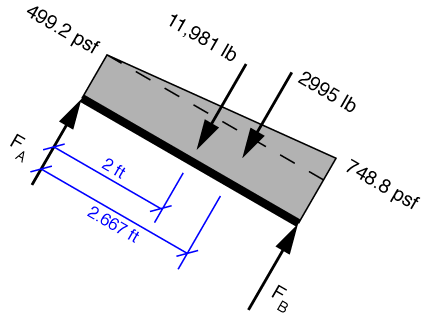

# Problem 69 #

In outline, this problem is the same as [the last one][1]. The free-body diagram of the right-hand trap door looks like this:

where we've used a unit weight of 124.8 pcf to calculate the pressures and resultant forces associated with the trapezoidal pressure distribution. Taking moments about point A, we get this equilibrium equation:

\[ \sum M_A = F_B \cdot 4 - 11,981 \cdot 2 - 3994 \cdot \frac{2 \cdot 4}{3} = 0 \]

The solution is \(F_B = 7987\,\rm{lbs}\), which, apart from round-off, is the answer given in the back of the book.

[1]: problem068.html

