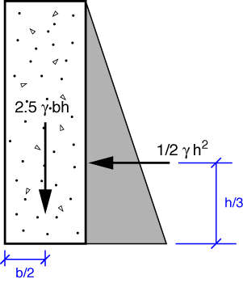

# Problem 70 #

The free-body diagram of the dam and the water pressure acting on its face is given below.

You may notice that the resultant forces for the weight and lateral water pressure don't have units of force (\(\gamma\) is the unit weight of water and has units of force per length cubed). They represent the force per unit length in the direction of the paper (or screen).

Taking moment equilibrium about the lower left corner of the dam gives

\[ 2.5 \gamma b h \frac{b}{2} = \frac{1}{2} \gamma h^2 \frac{h}{3} \]

or

\[ b^2 = \frac{2}{15} h^2 \]

So \(b\) must be at least \(\sqrt{2/15} h\) to keep the dam from overturning.
