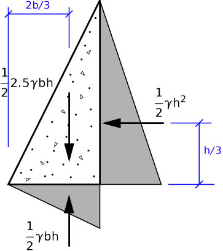

# Problem 71 #

This one's just a bit more complicated than [the last one][1], mainly because of the upward pressure on the bottom of the dam. The free-body diagram looks like this:

and the moment equilibrium equation about the bottom left corner of the dam, which we'll call O, is

\[ \sum M_O = \frac{1}{2} 2.5 \gamma bh \cdot \frac{2b}{3} - \frac{1}{2} \gamma h^2 \cdot \frac{h}{3} - \frac{1}{2} \gamma bh \cdot \frac{2b}{3} = 0 \]

The solution is

\[ b^2 = \frac{h^2}{3} \]

or \(b = \sqrt{1/3} h\). This is the minimum width to keep the dam from overturning.

This dam uses less concrete than the rectangular one in [Problem 70][1] (\(1/2 \sqrt{1/3} h^2 = \sqrt{1/12} h^2\) vs. \(\sqrt{2/15} h^2\)). The increase in efficiency is due to the rightward (upstream) shift of the center of gravity of the dam. Presumably, we could get even more efficient designs by using parabolic, cubic, or higher-order downstream shapes, but there are practical limits to how thin you can make the top of the dam, and the labor costs of making curved formwork may overcome any material savings you may achieve.

[1]: problem070.html

