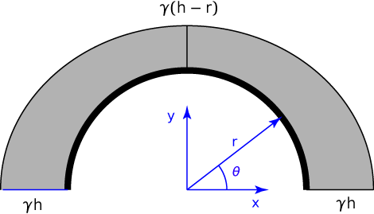

# Problem 72 #

The pressure on the culvert varies with depth, as shown in the diagram below. 

The most convenient way to define the pressure distribution is with polar coordinates:

\[ p = \gamma (h - r \sin\theta) \]

The vertical component of this pressure is

\[ p_v = p \sin\theta = \gamma h \sin\theta - \gamma r \sin^2\theta \]

The total vertical force on the culvert (per unit length perpendicular to the paper/screen) is twice the integral of this pressure from base to crown:

\[ 2 \int_0^{\pi/2} p_v r\, d\theta = 2 \left[ \gamma rh\int_0^{\pi/2} \sin\theta\, d\theta - \gamma r^2 \int_0^{\pi/2} \sin^2\theta\, d\theta \right]\]

Working out the integral, we get

\[ 2 \gamma\,r (h - \frac{\pi r}{4}) \]

or

\[ \gamma\,d (h - \frac{\pi d}{8}) \]

which is the answer to part a).

Part b) is just plug and chug:

\[ 2.5 \cdot 62.4 \cdot 6 ( 6 - \frac{6 \pi}{8}) = 3410\,\rm{lb/ft} \]
