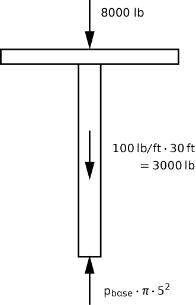

# Problem 74 #

Here's a good practical problem that's easy to solve if you don't get lost in the details. The basic free-body diagram of the piston and elevator car is shown below.

There is, of course, pressure acting on the lateral sides of the piston that are immersed in oil, but those forces are purely horizontal and cancel each other out. Equilibrium of vertical forces gives us

\[ p_{base} \cdot \pi \cdot 5^2 = 8000 + 100 \cdot 30 = 11,000 \]

where \(p_{base}\) must be expressed in psi.

When the elevator is at the top of its range of motion the pressure at the base of the piston is equal to the pressure delivered by the pump, so

\[ p_{pump} = p_{base} = \frac{11,000}{25 \pi} = 140\,\rm{psi} \]

When the elevator is at the bottom of its range of motion, we have to account for the pressure of 30 feet of hydraulic oil. Now,

\[ p_{base} = p_{pump} + \frac{30 \cdot 0.9 \cdot 62.4}{144} = p_{pump} + 11.70 \]

where the division by 144 converts the pressure due to the column of oil from psf to psi. Plugging this into our expression for vertical equilibrium gives us

\[ p_{pump} + 11.70 = \frac{11,000}{25 \pi} = 140\,\rm{psi} \]

and therefore, \(p_{pump} = 128\,\rm{psi}\).
