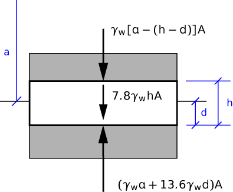

# Problem 76 #

The easy thing to forget in this problem is that the pressure in mercury is not due entirely to the depth within the mercury--there is an additional amount due to the weight of water pressing down on the top surface of the mercury.

We'll start with this free-body diagram:

The distance *a* is from the free surface of the water to the interface between the water and the mercury. We use *h* to represent the height of the steel piece, *A* for its horizontal cross-sectional area, and *d* for the depth immersed in mercury. The weight of the steel piece is the product of its density and its volume; the resultant force on the top surface of the steel is the product of the pressure in the water and the cross-sectional area; the resultant force on the bottom surface of the steel is the product of the pressure in the mercury and the cross-sectional area.

Vertical equilibrium gives us

\[ 7.8 \gamma_w h A + \gamma_w (a - h + d) A = \gamma_w a A + 13.6 \gamma_w d A \]

the solution of which is \(d = 0.54 h\). This is how much the steel is immersed in the mercury. Den Hartog asked how much of the steel is in the water, so the answer to his question is \(d = 0.46 h\).

