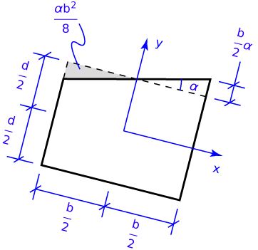
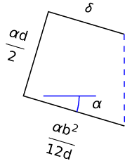

# Problem 77 #

The keys to this problem are:

* Because the weight of the ship is the same the displaced volume of water is the same.
* The vertical resultant of the upward buoyant force passes through the centroid of the displaced water (this is shown on pp. 50-51 of the book).
* The angle that the ship tilts is *small*, so we can use small-angle theory to simplify the trigonometry.

What is small-angle theory? At its simplest, it says that if an angle is small enough, its sine and tangent are equal to the angle itself (when the angle is measured in radians), and its cosine is one. These approximations are within 1% of the exact values for angles up to 0.14 radians (8°).

A more complete explanation of small-angle theory is that it keeps terms that are linear in the angle, but ignores any higher-order terms. For trig functions, this is equivalent to what we just said about sines, cosines, and tangents. Recall the [Taylor series expansions][1] of these functions are

\[ \sin x = x - \frac{x^3}{6} + \frac{x^5}{120} - \ldots \]

\[ \cos x = 1 - \frac{x^2}{2} + \frac{x^4}{24} - \ldots \]

\[ \tan x = x + \frac{x^3}{3} + \frac{2 x^5}{15} + \ldots \]

and ignoring the higher order terms gives us \(\sin x = \tan x = x\) and \(\cos x = 1\).

We'll start this problem by looking at the ship in the tilted position. 

Our strategy is to determine the location of the centroid of the displaced water, and to determine \(\delta\) in terms of \(\alpha\) by recognizing that moment equilibrium of the ship requires the c.g. to be aligned with the resultant of the upward buoyant force.

We use a tilted coordinate system with its origin at the centroid of the original submerged rectangle. We take the current submerged shape to be the composite of that rectangle, a triangle to the right, and a negative-space triangle to the left. Small-angle theory gives us the dimensions of the triangles, and the new centroid of the displaced water is at

\[ \bar x = \frac{\frac{\alpha b^2}{8} \left(\frac{2}{3}\frac{\alpha b}{2} \right) - \frac{\alpha b^2}{8} \left( -\frac{2}{3}\frac{\alpha b}{2} \right)}{bd} = \frac{\alpha b^2}{12 d} \]

\[ \bar y = \frac{\frac{\alpha b^2}{8} \left(\frac{d}{2} + \frac{1}{3}\frac{\alpha b}{2} \right) - \frac{\alpha b^2}{8} \left(\frac{d}{2} - \frac{1}{3}\frac{\alpha b}{2} \right)}{bd} = \frac{\alpha^2 b^2}{24 d} \]

Since small-angle theory tells us to ignore higher-order terms, we can take \(\bar y\) to be zero.

For equilibrium, the c.g. of the ship must be vertically aligned with this centroid. Looking at the figure below, and applying small-angle theory, we get

\[ \delta = \frac{\alpha b^2}{12 d} - \frac{d}{2}\alpha = \alpha \left( \frac{b^2}{12 d} - \frac{d}{2} \right) \]

[1]: http://en.wikipedia.org/wiki/Taylor_series

