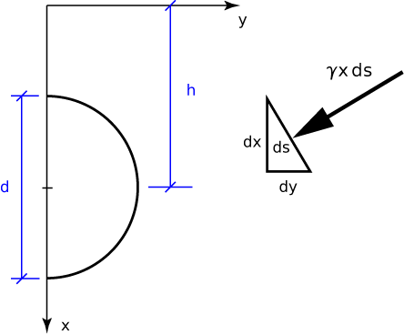

# Problem 79 #

The pressure on the surface of the cylinder, whether due to mercury or water, is always acting perpendicular to the surface--in other words, radially. Hence, there can be no moment about the pivot and therefore no rotation. This is the answer to part a).

What, you may be asking, about the results on pp. 50-51 of the book, showing that the upward buoyant force acts through the centroid of the submerged body? Isn't that proof of the inventor's claim? Well, if you follow the derivation carefully, you'll see that the differential vertical force, *dV*, is assumed to be acting over the entire submerged surface, not just the left or right half. Since the assumptions are different, we can't use the results.

As for part b), we'll start by creating a coordinate system in which the *y* axis runs along the surface of the liquid and the *x* axis goes down into it. We'll call the average depth of the semicircle *h*.

The differential force on a differential chunk of the circle, \(ds\), is \(\gamma x\, ds\) and is directed at right angles to the surface. The horizontal component of this force is \(dH = \gamma x\,ds \frac{dx}{ds} = \gamma x\,dx\). Integrating this around the semicircle gives us

\[ \int \gamma x\,dx = \gamma \left[\frac{1}{2}x^2\right]_{x_{min}}^{x_{max}} = \frac{\gamma (x_{max}^2 - x_{min}^2)}{2} = \gamma \frac{x_{max} + x_{min}}{2} (x_{max} - x_{min}) = \gamma hd \]

This is the force per unit length perpendicular to the page, so to get the total force, we multiply by the length, *L*.

Using this general result for the two semicircles, we get a total force to the left of

\[ \gamma_m hdL - \gamma_w hdL = (\gamma_m - \gamma_w) hdL \]

This is both the force from the liquids onto the cylinder and the force from the cylinder onto the pivot.

To get the upward force on a semicircle, we integrate the vertical component of the differential force, \(dV = \gamma x\,ds \frac{dy}{ds} = \gamma x\,dy\).

\[ \int \gamma x\,dy = \gamma A = \frac{\gamma \pi r^2}{2} \]

That the integral of \(x\,dy\) over the surface is the area of the semicircle can be seen in the diagram below. The integral over the lower half gives the shaded area on the left, and the integral over the upper half subtracts off (because the integral goes in the opposite direction) the shaded area on the right. The result is the area of the semicircle.

The total upward force, then, is

\[ \frac{\gamma_m \pi r^2}{2} + \frac{\gamma_w \pi r^2}{2} = \frac{\gamma_m + \gamma_w}{2} \pi r^2 \]

This is both the force from the liquids onto the cylinder and the force from the cylinder onto the pivot.

