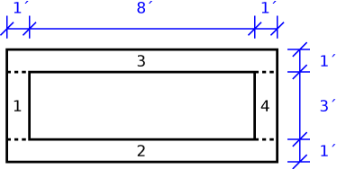
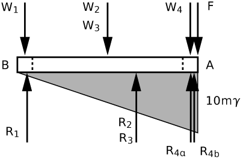
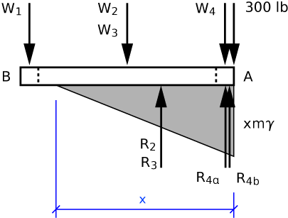

# Problem 80 #

As with many real-world problems, this one is not particularly difficult in concept, but it does require care in keeping track of all the forces and dimensions.

We'll start by dividing the float into four parts as shown below. The float is 1 foot in depth.

The free-body diagram, as viewed from the side, looks like this:

We'll call the slope of the float *m*, so the slope of the pressure distribution on the bottom of the float is \(\gamma m\), where \(\gamma\) is the unit weight of water. The pressure is zero at point B because we are told that the float is just touching the water at that end.

The weights of the parts are:

\[ W_1 = W_4 = 10.4 \cdot 3\cdot 1 \cdot 1 = 31.2\,\rm{lb} \]

\[ W_2 = W_3 = 10.4 \cdot 10 \cdot 1 \cdot 1 = 104\,\rm{lb} \]

The resultants of the upward pressure are:

\[ R_1 = R_{4b} = \frac{1}{2}\gamma m \cdot 1 \cdot 3 = 1.5 \gamma m \]

\[ R_2 = R_3 = \frac{1}{2}(10 \gamma m) \cdot 10 \cdot 1 = 50 \gamma m \]

\[ R_{4a} = 9 \gamma m \cdot 1 \cdot 3 = 27 \gamma m \]

The pressure acting on part 4 has a trapezoidal distribution and, for simplicity, has been split into two parts: a uniform pressure of \(9 \gamma m\), and a triangular pressure that rises an additional \(\gamma m\). The resultants \(R_{4a}\) and \(R_{4b}\) come from these pressures.

We'll use \(a_i\) to denote the distances of the \(W_i\) from point A, and \(b_i\) to denote the distances of the \(R_i\) from point A. These are

\[ a_1 = 9.5, \quad a_2 = a_3 = 5, \quad a_{4a} = 0.5, \quad a_{4b} = 0.333 \]

\[ b_1 = 9.333, \quad b_2 = b_3 = 3.333, \quad b_{4a} = 0.5, \quad b_{4b} = 0.333 \]

Our strategy is similar to that used by Den Hartog to solve the (simpler) beam problem on pp. 43-45 in the book. We're going to determine the position of the resultant of all the downward forces--which will be in terms of *F*, our unknown force applied at point A--and the position of the upward resultant. Setting these positions equal, as required by moment equilibrium, we get

\[ \frac{W_1a_1 + W_2a_2 + W_3a_3 + W_4a_4}{W_1 + W_2 + W_3 + W_4 + F} =  \frac{R_1b_1 + R_2b_2 + R_3b_3 + R_{4a}b_{4a} + R_{4b}b_{4b}}{R_1 + R_2 + R_3 + R_{4a} + R_{4b}}\]

Plugging in the previous values, the solution is \(F = 216\,\rm{lb}\) (the \(\gamma m\) terms drop out). This is the answer to part a).

For part b), we do much the same thing, but because the left end of the float lifts out of the water, the triangular pressure distribution goes to zero some distance from the right end. Although the wetted length of the float is set up as a variable (\(x\), in accordance with Den Hartog's hint), we still have to make an assumption about it: namely, is it more or less than 9 feet? If it's more than 9 feet, we have to account for pressure acting on part 1; if it's less than 9 feet, we don't. Because it's less work, we'll make the latter assumption and check it when we're done.

The FBD looks like this:

The weights of the float parts and their positions remain the same, the pressure resultants and their positions change to

\[ R_2 = R_3 = \frac{1}{2} \gamma m x^2 \]

\[ R_{4a} = \gamma m (x - 1) \]

\[ R_{4b} = \frac{1}{2} \gamma m \]

\[ b_2 = b_3 = \frac{1}{3}x, \quad b_{4a} = \frac{1}{2}, \quad b_{4b} = \frac{1}{3} \]

Setting the positions of the downward and upward resultants equal gives us

\[ \frac{W_1a_1 + W_2a_2 + W_3a_3 + W_4a_4}{W_1 + W_2 + W_3 + W_4 + 300} =  \frac{R_2b_2 + R_3b_3 + R_{4a}b_{4a} + R_{4b}b_{4b}}{R_2 + R_3 + R_{4a} + R_{4b}} \]

Again, when we plug in the values, the \(\gamma m\) terms drop out and we get

\[ 2.3703 = \frac{x^3/3 + 3/2(x-1) + 1/2}{x^2 + 3(x-1) + 3/2} \]

By trial and error (which goes much faster now than it did in 1948), we get \(x = 8.90\,\rm{ft}\). Since this is less than 9 feet, our lazy assumption was correct and we can move on. Had the assumption been violated, we would have had to go back and redo the problem with some pressure acting on part 1.

We can solve for *m*, the slope of the float, by vertical equilibrium:

\[ 570.4 = 62.4 m [8.90^2 + 3(8.90-1) + 3/2] \]

So \(m = 0.0887\). The distance point B sticks out of the water, then is \(0.0887 (10 - 8.90) = 0.0976\,\rm{ft}\) or 1.17 inches. The answer in the back of the book is \(1\frac{1}{8}\) inches, which is close enough.

